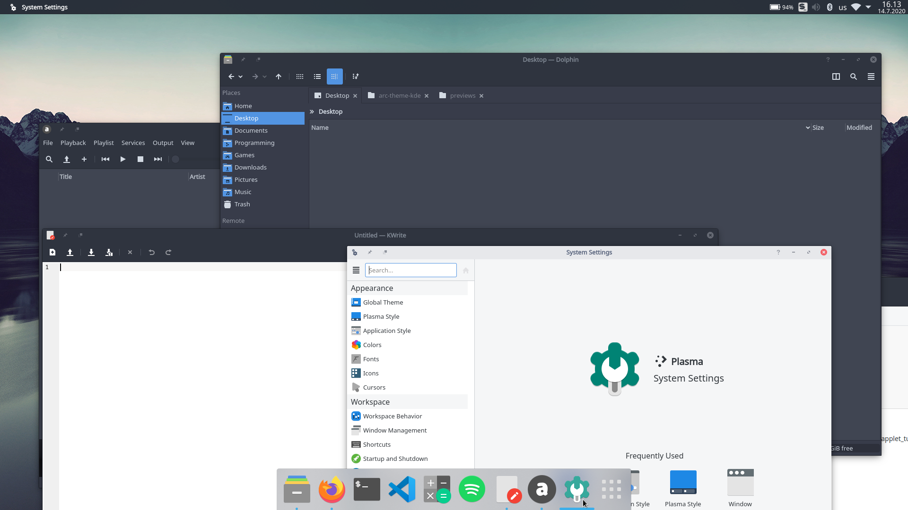

# Arc Theme for KDE
Arc theme for KDE. Unrelated to [arc-kde](https://github.com/PapirusDevelopmentTeam/arc-kde/) which is seemingly abandoned.


## Components
* **Window decoration (windeco)** - Arc window decoration based on the Breeze decoration, allowing for advanced customization (Arc/Arc Dark, window specific overrides)
* **Application style (kvantum)** - Kvantum application themes (Arc/Arc Dark/Arc Darker)
* **Splash screen (plasma/look-and-feel)** - Splash screen

## Missing Components
* Plasma theme, use Plasma theme from [arc-kde](https://github.com/PapirusDevelopmentTeam/arc-kde/)
* Color schemes, use KvArc/KvArcDark from [Kvantum](https://github.com/tsujan/Kvantum/tree/master/Kvantum/themes/colors)

## Recommended Complements
* Icons: [Papirus icon theme](https://github.com/PapirusDevelopmentTeam/papirus-icon-theme)
* Cursors: Adwaita or DMZ White
* GTK2/GTK3 theme: [arc-design/arc-theme](https://github.com/arc-design/arc-theme) or [jnsh/arc-theme](https://github.com/jnsh/arc-theme)

## Installing

### Window Decoration
This window decoration must be built and installed from source. It has been tested and built against KDE Plasma 5.18 and 5.19. See details in specific README.

Configure System Settings->Application Style->Window Decorations to use Arc. Choose edit to configure between Arc and Arc Dark and adjust other settings.

### Application Style
Requires [Kvantum](https://github.com/tsujan/Kvantum/tree/master/Kvantum) to be installed. Add the theme folders to ```~/.config/Kvantum/```.

Configure System Settings->Application Style to use kvantum and use Kvantum Manager to select Arc, ArcDark or ArcDarker.

### Splash Screen
Add the ```look-and-feel``` folder contents to ```~/.local/share/plasma/look-and-feel/```.

Configure System Settings->Startup and Shutdown->Splash Screen to use the Arc splash screen.

### Plasma Theme (3rd Party)
Place files into ```~/.local/share/plasma/desktoptheme/```.

### Color Scheme (3rd Party)
Place files into ```~/.local/share/color-schemes/```.

## Acknowledgments
* horst3180 for the [original GTK Arc theme](https://github.com/horst3180/arc-theme)
* varlesh for the [arc-kde](https://github.com/PapirusDevelopmentTeam/arc-kde/)
* tsujan for [Kvantum/KvArk/KvArkDark](https://github.com/tsujan/Kvantum/tree/master/Kvantum)
